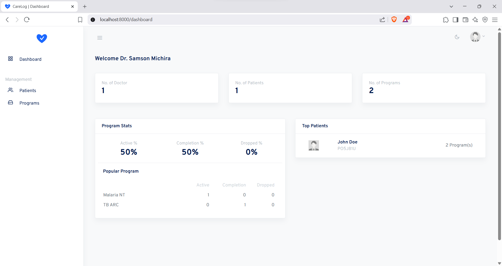

<!-- Logo slot -->
<p align="center">
  
</p>

# CareLog

**Modern health-information system & REST API**  
_Built with Laravel 12_

---

## What is CareLog?

CareLog is a lightweight electronic health–record module that allows doctors to do the following:

-   Register and manage patients and their program enrollments
-   Track program performance
-   Expose patient profiles to third-party systems via a secure API

Everything runs on Laravel 12, so deployment is just **PHP + MySQL**.

---

## Key Features

### Web application

| Category            | Capabilities                                                                                 |
| ------------------- | -------------------------------------------------------------------------------------------- |
| **Authentication**  | Email / password login                                                                       |
| **Dashboard**       | System summary details for doctors, patients, programs and enrolment breakdowns              |
| **Patient module**  | • Register / edit patients<br>• View Patient profile<br>• Enroll patients to programs        |
| **Program module**  | • Create / edit / delete programs<br>• Deleting a program cascades to remove its enrollments |
| **Search & filter** | Gender, age group, enrolment status, program                                                 |
| **UX niceties**     | Modal-first workflow (no page hops), responsive tables, role-based side-nav                  |

### REST API

| Verb   | Endpoint                        | Description                                                                                                                         |
| ------ | ------------------------------- | ----------------------------------------------------------------------------------------------------------------------------------- |
| `POST` | `/api/auth`                     | Accepts `email` & `password`, returns a **5-minute bearer token** on success                                                        |
| `GET`  | `/api/patients/{patientNumber}` | Secure profile lookup (token in `Authorization: Bearer {token}`)<br>Returns patient data + program enrollments or JSON error object |

> **Error envelope**
>
> ```json
> // 401, 404, 422, 500, …
> { "code": 404, "error": "Patient not found" }
> ```

---

## Technology Stack

-   **Laravel 12** (PHP 8.3) – backend & Blade views
-   **Laravel Sanctum** – API token auth
-   **Bootstrap 4** – UI components & grid
-   MySQL 8 / MariaDB 10.5+

---

## Screenshots

|                                                           |                                                                 |
| --------------------------------------------------------- | --------------------------------------------------------------- |
| **Dashboard summary**                                     | **Patient profile with enrollments**                            |
|  |  |
| **REST API RESPONSE**                                     | **PROGRAM DETAILS**                                             |
|        |  |

---

## Database Model


---

## Getting Started

### Prerequisites

| Tool       | Version                     |
| ---------- | --------------------------- |
| PHP        | 8.3 +                       |
| Composer   | 2 +                         |
| Node / npm | 18 + (for front-end build)  |
| MySQL      | 8 + (or compatible MariaDB) |

### 1. Clone & install

```bash
git clone https://github.com/omichsam/carelog.git
cd carelog

cp .env.example .env      # complete the set ups
composer install --prefer-dist
php artisan key:generate
```

### 2. Database & seed

```bash
php artisan migrate --seed
```

### 3. Serve

```bash
php artisan serve      # http://127.0.0.1:8000
```

Login with the seeded doctor.  
Generate an API token via `POST /api/auth`.
